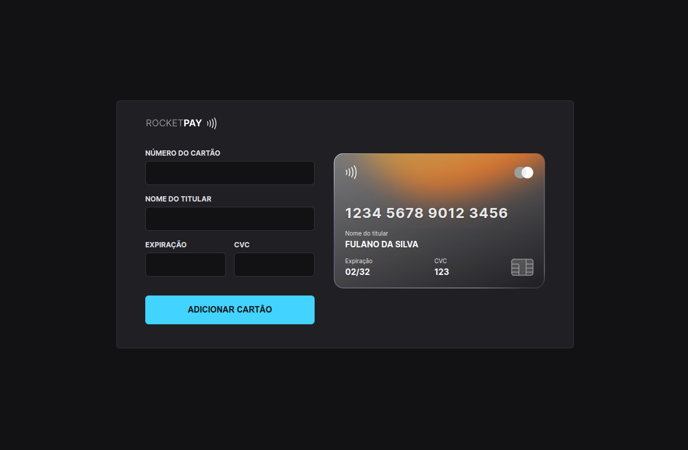

<h1 align="center"> Interface Método de Pagamento </h1>

Construção de uma interface simples para adição de métodos de pagamento feita em React.

  <a href="#-tecnologias">Tecnologias</a>&nbsp;&nbsp;&nbsp;|&nbsp;&nbsp;&nbsp;
  <a href="#-projeto">Projeto</a>&nbsp;&nbsp;&nbsp;|&nbsp;&nbsp;&nbsp;
  <a href="#-layout">Layout</a>&nbsp;&nbsp;&nbsp;|&nbsp;&nbsp;&nbsp;
  <a href="#memo-licença">Licença</a>

  

 

  

## 🚀 Tecnologias

Esse projeto foi desenvolvido com as seguintes tecnologias:

- HTML5, CSS3, Javascript (ES6+)
- [Node e Yarn](https://nodejs.org/)
- [Vite](https://vitejs.dev/)
- [React](https://reactjs.org/)
- [Styled-Components](https://styled-components.com/)
- [Toastify](https://www.npmjs.com/package/react-toastify)
- [iMask](https://imask.js.org)

## 💻 Projeto

Este projeto é um componente que simula o formulário de preenchimento de cartão de crédito, onde é possível adicionar máscara aos inputs e atualizar elementos HTML via DOM utilizando React como biblioteca.

## 🔖 Layout

Você pode visualizar o layout do projeto [aqui](https://www.figma.com/file/yqmLahQFlQ4QwVFHHPQ8Gx/react-add-payment-method?node-id=0%3A1). É necessário ter conta no [Figma](https://figma.com) para acessá-lo.

## 📝 Licença

Esse projeto está sob a licença MIT.

---
